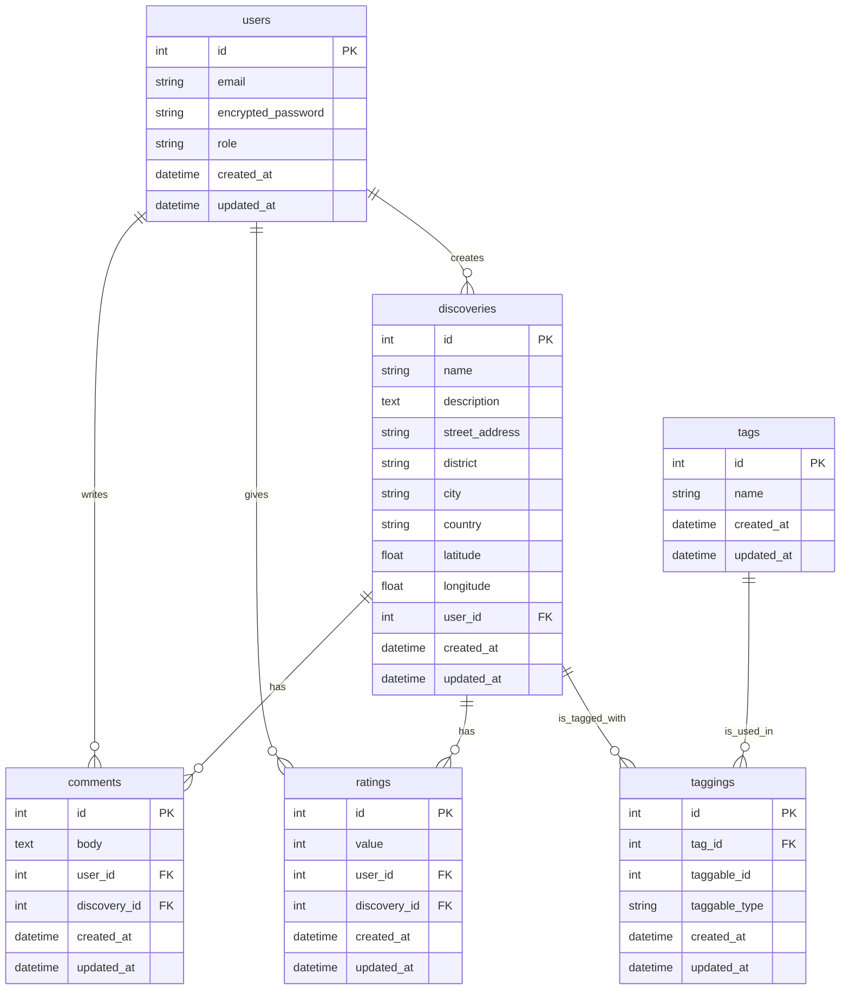

### **Tài liệu Yêu cầu Sản phẩm (PRD): Local Discovery Hub**

*   **Ngày tạo:** 12/11/2025
*   **Phiên bản:** 1.0

#### **1. Tổng quan**

*   **Tên sản phẩm:** Local Discovery Hub
*   **Mục tiêu:** Xây dựng một nền tảng cộng đồng để chia sẻ và khám phá các địa điểm, sáng kiến ("viên ngọc ẩn") tại địa phương. Mục tiêu là thúc đẩy sự gắn kết cộng đồng, hỗ trợ kinh doanh nhỏ và khuyến khích mọi người khám phá những giá trị xung quanh mình.
*   **Đối tượng mục tiêu:** Người dân địa phương, khách du lịch muốn có trải nghiệm chân thực, các nhà tổ chức cộng đồng.

#### **2. Vai trò người dùng**

1.  **Khách (Visitor):** Bất kỳ ai truy cập trang web mà không đăng nhập.
2.  **Thành viên (Member):** Người dùng đã đăng ký tài khoản và đăng nhập.
3.  **Quản trị viên (Admin):** Người dùng có toàn quyền quản lý hệ thống.

#### **3. Các tính năng và chức năng**

**F1: Quản lý Tài khoản Người dùng (Xác thực)**
*   Người dùng có thể đăng ký tài khoản mới, đăng nhập và đăng xuất.
*   *Công nghệ đề xuất:* Gem `Devise`.

**F2: Phân quyền dựa trên Vai trò (Phân quyền)**
*   **Khách:** Chỉ có thể xem nội dung.
*   **Thành viên:** Có thể tạo nội dung mới; xem/sửa/xóa nội dung của chính mình.
*   **Admin:** Có thể quản lý tất cả nội dung (sửa/xóa của bất kỳ ai).
*   *Công nghệ đề xuất:* Gem `CanCanCan`, lưu vai trò dạng chuỗi (`string`) trong bảng `users`.

**F3: Quản lý "Khám phá" (CRUD)**
*   Thành viên có thể tạo một "Khám phá" mới với các thông tin: Tên, Mô tả, Địa chỉ (đường, quận/huyện, thành phố, quốc gia), và các Thẻ (Tags).
*   Thành viên có thể sửa, xóa các "Khám phá" do mình tạo.
*   Tất cả người dùng có thể xem danh sách và chi tiết của các "Khám phá".

**F4: Hệ thống Gắn thẻ (Tagging)**
*   Khi tạo/sửa "Khám phá", Thành viên có thể gắn nhiều thẻ (ví dụ: "ẩm thực", "cà phê", "yên tĩnh").
*   Người dùng có thể tạo ra các thẻ mới một cách linh hoạt.
*   Hệ thống có thể gợi ý các thẻ đã tồn tại.
*   Người dùng có thể lọc các "Khám phá" bằng cách nhấp vào một thẻ.
*   *Công nghệ đề xuất:* Gem `acts-as-taggable-on`.

**F5: Bình luận (Comments)**
*   Thành viên có thể viết bình luận dưới trang chi tiết của một "Khám phá".
*   Thành viên có thể sửa/xóa bình luận của chính mình.

**F6: Đánh giá (Ratings)**
*   Thành viên có thể đánh giá một "Khám phá" theo thang điểm 1-5 sao.
*   Mỗi thành viên chỉ được đánh giá một "Khám phá" một lần.
*   Điểm đánh giá trung bình và tổng số lượt đánh giá sẽ được hiển thị.

**F7: Bản đồ và Định vị địa lý (Mapping & Geolocation)**
*   Khi một "Khám phá" được tạo, địa chỉ của nó sẽ được tự động chuyển thành tọa độ (kinh độ, vĩ độ).
*   Trang chi tiết sẽ hiển thị vị trí của "Khám phá" trên bản đồ.
*   Trang danh sách chính có thể có một bản đồ tổng quan hiển thị tất cả các địa điểm.
*   *Công nghệ đề xuất:* Gem `Geocoder`, bản đồ nền từ OpenStreetMap, thư viện hiển thị Leaflet.js.

**F8: Tìm kiếm theo Vị trí**
*   Người dùng có thể tìm kiếm các "Khám phá" ở gần vị trí hiện tại của họ.
*   Người dùng có thể tùy chỉnh bán kính tìm kiếm (ví dụ: 1km, 5km, 10km).
*   *Công nghệ đề xuất:* Geolocation API của trình duyệt, scope `.near` của gem `Geocoder`.

#### **4. Mô hình Dữ liệu (Database Schema)**

Mã Mermaid dưới đây biểu diễn cấu trúc cơ sở dữ liệu đã được thống nhất:

#### **5. Các tính năng ngoài phạm vi (Future Enhancements)**

Các tính năng sau đã được thảo luận nhưng sẽ được xem xét cho các phiên bản tương lai để đảm bảo phiên bản 1.0 được ra mắt đúng tiến độ và không quá phức tạp:
*   Hệ thống kiểm duyệt nội dung nâng cao.
*   Tính năng cho phép người dùng đề xuất chỉnh sửa thông tin.
*   Tích hợp Trí tuệ nhân tạo (Gemini AI) để làm giàu nội dung hoặc tìm kiếm thông minh.
*   Tích hợp Webhook để gửi thông báo đến các dịch vụ bên ngoài (Discord, Slack).
*   Hệ thống vai trò phức tạp với bảng `roles` riêng biệt.